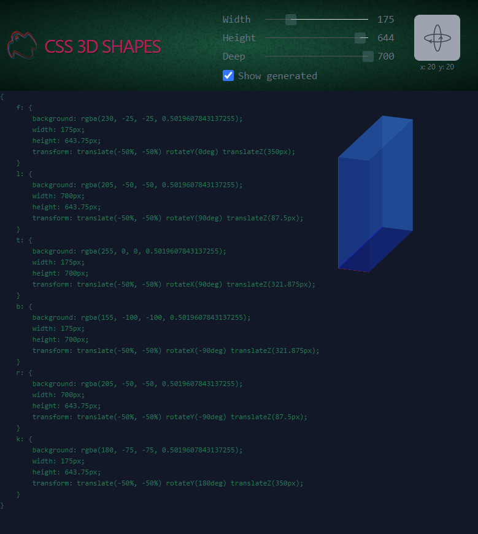

#### About

Experimanting with pseudo-3D shapes.

#### Inspirations, references, credits

[Tweakpane](https://github.com/cocopon/tweakpane)
[Cube generator](https://css-cube-generator.netlify.app/)
[Microscope icon](https://www.mcicon.com/product/microscope-icon-8/)
[Slider background](twitter.com/anatudor/status/1392768399034490881)